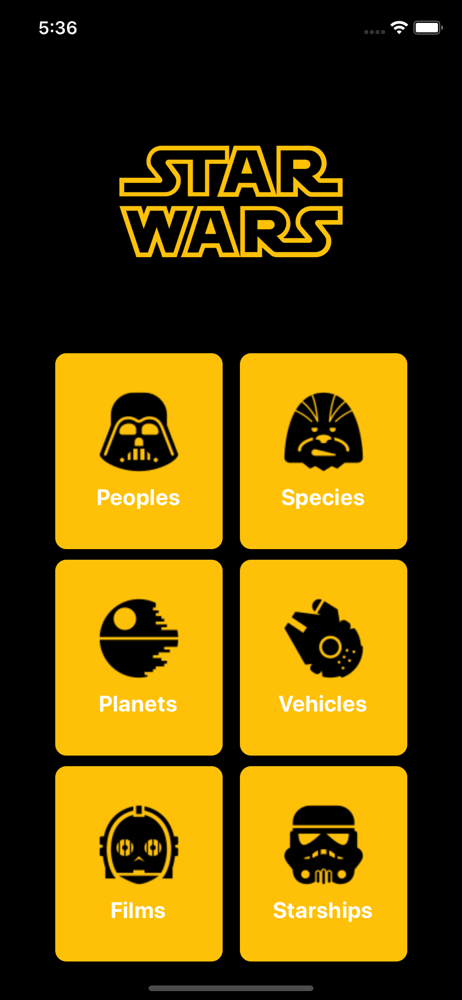

## App StarWars

<p align="center">
  
</p>

## :iphone: Run it!

```bash

# Install the dependencies
yarn install

# Run the application
yarn ios or expo start

# Command to run the tests
yarn test


```

## :exclamation: Test performed only on IOS

## Technology

- Expo
- react-native
- React navigation v5
- @expo/vector-icons
- Jest


Made with much :purple_heart: and :muscle: by Jhow Paes :blush: <a href="https://www.linkedin.com/in/jhowpaes/">Talk to me!</a>